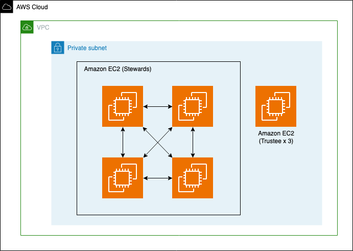

# Sample AWS Blockchain Node Runner app for Hyperledger Indy

| Contributed by |
|:--------------------:|
| [@fsatsuki](https://github.com/fsatsuki) |

[View this page in Japanese (日本語)](./README_ja.md)

## Architecture Overview



This is a sample of building a Hyperledger Indy network on AWS.
The overall architecture is shown below, processing itself is performed by 4 Stewards (Validator Nodes), and network management is performed with Trustee. It consists of 4 EC2 instances for Steward and 3 EC2 instances for Trustee.

## Solution Walkthrough

### Setup Cloud9

We will use AWS Cloud9 to execute the subsequent commands. Follow the instructions in [Cloud9 Setup](../../docs/setup-cloud9.md)

### Clone this repository and install dependencies

```bash
git clone https://github.com/aws-samples/aws-blockchain-node-runners.git
cd aws-blockchain-node-runners
npm install
```

**NOTE:** In this tutorial we will set all major configuration through environment variables, but you also can modify parameters in `config/config.ts`.

### Deploy Indy Nodes

#### Building resources

1. Configure  your setup

Create your own copy of `.env` file and edit it:
```bash
   # Make sure you are in aws-blockchain-node-runners/lib/indy
   cd lib/indy
   pwd
   cp ./sample-configs/.env-sample .env
   nano .env
```
   **NOTE:** You can find more examples inside the `sample-configs` directory.

1. Setting up initial AWS Cloud Development Kit (CDK)

The following command is executed only when using AWS CDK for the first time in the region where the deployment will be carried out.

```bash
npx cdk bootstrap aws://<INSERT_YOUR_AWS_ACCOUNT_NUMBER>/<INSERT_YOUR_AWS_REGION>
```

3. Deploying resources with CDK

```bash
npx cdk deploy --json --outputs-file indy-test-deploy-output.json

```

The output should look like this::

```
IndyNetworkStack.AnsibleFileTransferBucketName = 111122223333-ansible-file-transfer-bucket
IndyNetworkStack.steward1steward1InstanceId2F9F8910 = i-1234567890abcdef1
IndyNetworkStack.steward2steward2InstanceId995438F2 = i-1234567890abcdef2
IndyNetworkStack.steward3steward3InstanceIdB5D10BBE = i-1234567890abcdef3
IndyNetworkStack.steward4steward4InstanceIdB3DD7753 = i-1234567890abcdef4
IndyNetworkStack.trustee1trustee1InstanceId8FDDE052 = i-1234567890abcdef5
IndyNetworkStack.trustee2trustee2InstanceIdE12079EA = i-1234567890abcdef6
IndyNetworkStack.trustee3trustee3InstanceId508C4E4C = i-1234567890abcdef7
```

**NOTE:** User data for the Steward instance is created by referring to [the Community Docs](https://github.com/hyperledger/indy-node/blob/main/docs/source/install-docs/AWS-NodeInstall-20.04.md).

#### Building an environment using Ansible

When running on a Mac, set the following environment variables.

> export OBJC_DISABLE_INITIALIZE_FORK_SAFETY=YES


##### Preparing for Ansible

- Create a Python virtual environment and install ansible
 ```bash
    cd ansible
    python3 -m venv venv
    source ./venv/bin/activate
 ```

 ```bash
    pip install -r requirements.txt
 ```

##### Describe instance information to be built in inventory.yml

- Create an inventory file containing information on the EC2 instance that will build the environment. Enter the instance ID described in the CDK output results in the settings column for each node. The value of `indyNetworkStack.ansibleFileTransferBucketName` described in CDK output results is inputted to `ansible_aws_ssm_bucket_name`. When Ansible transfers files to the target host, the Amazon Simple Storage Service (Amazon S3) bucket specified here is used.

```bash
  cd ..
  ./configure-ansible-inventory.sh
```


##### Ansible parameter settings
To change Indy's network name, open `ansible/inventory/group_vars/all.yml` file and change the parameter used by Ansible

```
INDY_NETWORK_NAME: sample-network
```

##### Execute environment construction with Ansible

- Use ansible's `ping` module to confirm that ansible can connect to the instance set in inventory/inventory.yml

```bash
  cd ansible
  ansible -m ping all -i inventory/inventory.yml
```
  The response should look like this:

```bash
  steward2 | SUCCESS => {
      "changed": false,
      "ping": "pong"
  }
  steward3 | SUCCESS => {
      "changed": false,
      "ping": "pong"
  }
  trustee1 | SUCCESS => {
      "changed": false,
      "ping": "pong"
  }
  steward4 | SUCCESS => {
      "changed": false,
      "ping": "pong"
  }
  trustee2 | SUCCESS => {
      "changed": false,
      "ping": "pong"
  }
  trustee3 | SUCCESS => {
      "changed": false,
      "ping": "pong"
  }
  steward1 | SUCCESS => {
      "changed": false,
      "ping": "pong"
  }
```

- Before proceeding with configuring Indy, we need to make sure the initialization scripts are finished. To check their stats, use ansible's `command` module. If the check shows cloud-init is not finished wait and try again in 5-10 minutes until status was done.

```bash
  ansible -m command all -i inventory/inventory.yml  -a "cloud-init status --wait"
```
  The response should look like this:

```bash
  steward4 | CHANGED | rc=0 >>

  status: done
  steward3 | CHANGED | rc=0 >>

  status: done
  steward2 | CHANGED | rc=0 >>

  status: done
  steward1 | CHANGED | rc=0 >>

  status: done
  trustee1 | CHANGED | rc=0 >>

  status: done
  trustee2 | CHANGED | rc=0 >>

  status: done
  trustee3 | CHANGED | rc=0 >>

  status: done
```

- Execute Hyperledger Indy environment construction for target EC2 instances defined in `inventory/inventory.yml` in ansible
```bash
    ansible-playbook playbook/site.yml
```

## Clearing up and undeploying everything

1. Remove Indy's seed, nodeInfo, did on the Secrets Manager

```bash
    # make sure you are in 'ansible' directory
    cd ansible
    ansible-playbook playbook/999_cleanup.yml
```

2. Undeploy Indy Nodes

```bash
   # Setting the AWS account id and region in case local .env file is lost
    export AWS_ACCOUNT_ID=<your_target_AWS_account_id>
    export AWS_REGION=<your_target_AWS_region>

   pwd
   # Make sure you are in aws-blockchain-node-runners/lib/indy

    # Undeploy Indy Node
    npx cdk destroy --all
```


#### reference information

-   [Buidling Indy Network](https://github.com/pSchlarb/indy-node/blob/documentationUpdate/docs/source/NewNetwork/NewNetwork.md)
-   [Setting up EC2 instances for Indy Node](https://github.com/hyperledger/indy-node/blob/main/docs/source/install-docs/AWS-NodeInstall-20.04.md)
-   [Setting up Indy Node](https://github.com/pSchlarb/indy-node/blob/documentationUpdate/docs/source/installation-and-configuration.md)
    ​

### Considerations

Matters to be examined in additional development etc. when using this sample are described.

-   Change the instance type to M
    -   Currently, it is a T instance, but in production environments, it is recommended to change to M
-   Fix the security group for Node NICs attached to Steward (Validator Node)
    -   Limit source IPs to node IPs of other nodes (currently open within VPC and can also be accessed by clients)
    -   Fix Node's private IP
-   If necessary, change the subnet to which the node belongs to a public subnet
-   Make Steward and Node separate instances
