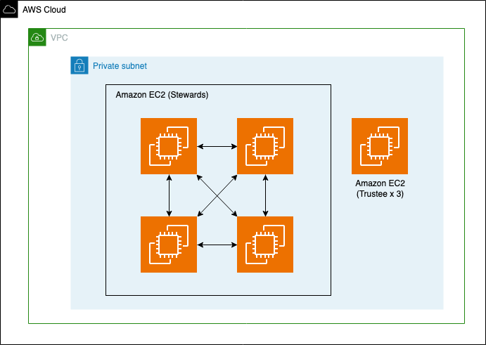

# Sample AWS Blockchain Node Runner app for Hyperledger Indy

[English](./README.md)

## Architecture Overview



本サンプルは Hyperledger Indy のネットワークを AWS 上に構築する。
全体像は下図の通り、処理自体は４つの Steward （Validator Node）で行われ、ネットワークの管理は Trustee で行われる。リソースの実態は、Steward 用の４つの EC2 インスタンスと、Trustee 用の１つの EC2 インスタンスである。

## Solution Walkthrough

### Setup Cloud9

We will use AWS Cloud9 to execute the subsequent commands. Follow the instructions in [Cloud9 Setup](../../docs/setup-cloud9.md)

### Clone this repository and install dependencies

```bash
git clone https://github.com/aws-samples/aws-blockchain-node-runners.git
cd aws-blockchain-node-runners
npm install
```

**NOTE:** In this tutorial we will set all major configuration through environment variables, but you also can modify parameters in `config/config.ts`.

### Deploy Indy Node

Indy Network を Steward 用の４つの EC2 インスタンスと、Trustee 用の１つの EC2 インスタンスを用いて構築する。下記手順の中で DID など各種情報を取得し、それらを[こちらのスプレッドシート](https://docs.google.com/spreadsheets/d/1LDduIeZp7pansd9deXeVSqGgdf0VdAHNMc7xYli3QAY/edit#gid=0)を参考にまとめる。

#### リソースの構築

npmの依存パッケージをインストール
```sh
cd lib/indy
pwd
# Make sure you are in aws-blockchain-node-runners/lib/indy
npm install
```
​
AWS Cloud Development Kit(CDK)の初期設定  
下記のコマンドはデプロイを実施するリージョンでAWS CDKを使用していない場合のみ実施する
```sh
npx cdk bootstrap
```

CDK でリソースの構築

```sh
npx cdk deploy

Outputs:
IndyNodeStack.Node1InstanceId = i-xxxxxxxxxxxxxxxxx
IndyNodeStack.Node2InstanceId = i-xxxxxxxxxxxxxxxxx
IndyNodeStack.Node3InstanceId = i-xxxxxxxxxxxxxxxxx
IndyNodeStack.Node4InstanceId = i-xxxxxxxxxxxxxxxxx
IndyNodeStack.TrusteeInstanceId = i-xxxxxxxxxxxxxxxxx
```
​
Indy Node (Steward) のインスタンスについては[こちら](https://github.com/hyperledger/indy-node/blob/main/docs/source/install-docs/AWS-NodeInstall-20.04.md)を参考にしている。
​
#### Trustee の設定
​
EC2 (もしくは SSM) のコンソールから Session Manager で Trustee インスタンスにログインして、Trustee/Steward の DID などの生成 (Trustee 3つ、Steward 4つの計７回、下記の操作を行う)
​

```sh
cd /
./indy-cli-rs
​
wallet create <wallet_name> key=<key>
wallet open <wallet_name> key=<key>
did new seed=<seed>
wallet close
```

#### Steward の設定​

ここでは Steward は Validator Node のことを表す（[参考情報](https://github.com/pSchlarb/indy-node/blob/documentationUpdate/docs/source/installation-and-configuration.md#32-validator-node-installation)）。

EC2 (もしくは SSM) のコンソールから Session Manager で Steward インスタンスにログインして、Validator verkey, BLS key, BLS POPの作成

```sh
sudo init_indy_node <alias> <node_ip> 9701 <client_ip> 9702 <seed>
```

#### Genesis filesの生成

1. これまでの手順で生成した情報を記載したスプレッドシートをダウンロード (Stewards and Trustees)
   - File → Download → .csv
2. `trustees.csv`/`stewards.csv` を Trustee に保存
    - ローカルにダウンロードした csv ファイルを Session Manager 経由で転送するには AWS CLI に加えて Session Manager Plugin が必要 [(参考情報)](https://dev.classmethod.jp/articles/ssm-session-manager-support-for-tunneling-ssh-scp-on-windows10/)
        - `scp -i <path_to_pem> <path_to_csv> ec2-user@<i-xxxxxxxx>:~/`
​
3. genesis file 生成

```sh
cd ~/
wget -nc https://raw.githubusercontent.com/sovrin-foundation/steward-tools/master/create_genesis/genesis_from_files.py
​
chmod +x genesis_from_files.py
./genesis_from_files.py --stewards stewards.csv --trustees trustees.csv

DEBUG:root:new line check for file: ./pool_transactions_genesis
INFO:root:Starting ledger...
INFO:root:Recovering tree from transaction log
INFO:root:Recovered tree in 0.00010979999979099375 seconds
DEBUG:root:new line check for file: ./domain_transactions_genesis
INFO:root:Starting ledger...
INFO:root:Recovering tree from transaction log
INFO:root:Recovered tree in 8.670999977766769e-05 seconds
```

#### Node の設定

各 Validator Node (Steward) の立ち上げを行う。
​
1. genesis files のダウンロードと各種ファイルの権限設定。genesis files は公開情報のためダウンロードできる場所に置いて良い (なければローカルでコピーも可)。`/var/lib/indy/`配下の全ファイルの権限を設定。 [参考 (Steward 部分の設定を実施)](https://github.com/pSchlarb/indy-node/blob/documentationUpdate/docs/source/NewNetwork/NewNetwork.md#iv-create-and-distribute-genesis-transaction-files)​

```sh
cd  /var/lib/indy/sample-network

# domain_transactions_genesis と pool_transactions_genesis を配置
# sudo curl -o domain_transactions_genesis <url_to_the_raw_domain_transactions_genesis_file>
# sudo curl -o pool_transactions_genesis  <url_to_the_raw_pool_transactions_genesis_file>

sudo chown -R indy:indy ../
```

2. indy-node の起動と動作確認。 [参考 (3.5.2 以降を実施)](https://github.com/pSchlarb/indy-node/blob/documentationUpdate/docs/source/installation-and-configuration.md#35-add-node-to-a-pool)
​

```sh
sudo systemctl start indy-node
sudo systemctl status indy-node
sudo systemctl enable indy-node
​
sudo validator-info
```

#### 参考情報

- [Indy Network の構築](https://github.com/pSchlarb/indy-node/blob/documentationUpdate/docs/source/NewNetwork/NewNetwork.md) 
- [Genesis files の作成](https://github.com/whi-product/atd-prototyping/wiki/Notes-%E2%80%90-%E6%96%B0%E8%A6%8FIndy-network%E7%94%A8Genesis-files%E3%81%AE%E4%BD%9C%E6%88%90%E6%96%B9%E6%B3%95)
- [Indy Node のための EC2 セットアップ](https://github.com/hyperledger/indy-node/blob/main/docs/source/install-docs/AWS-NodeInstall-20.04.md)
- [Indy Node のセットアップ](https://github.com/pSchlarb/indy-node/blob/documentationUpdate/docs/source/installation-and-configuration.md)
​

### 考慮事項

- インスタンスタイプを M 系に変更
    - 現状のプロトタイプでは T 系インスタンスとしているが本番環境では M 系などに変更を推奨
- EBS を追加
   - デフォルトのブロックストレージを追加? doc 参照
- Steward (Validator Node) のにアタッチされている Node NIC の Security Group を修正
    - Source IP を他ノードの Node IP に制限する (現在は VPC 内にオープンになっており、Client からもアクセスできる)
